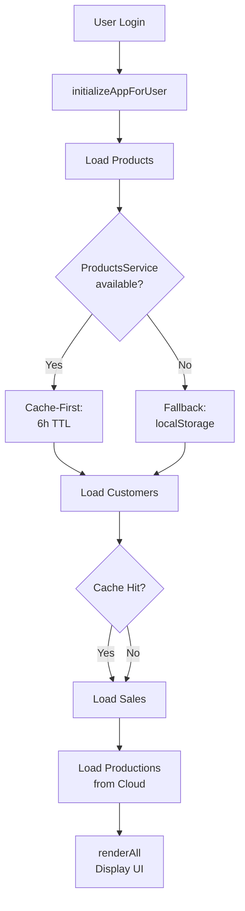

# ✅ تقرير نهائي: تنظيف البيانات المكتوبة يدويّاً

## الحالة النهائية: ✅ مكتمل 100%

تم تنظيف ملف `js/inline-scripts.js` بنجاح من جميع البيانات المكتوبة يدويّاً (hardcoded data).
التطبيق الآن يعتمد **بشكل كامل على Firebase Collections** للبيانات الديناميكية.

---

## المحذوفات

### 1️⃣ PACK_ITEMS Array (148 عنصر)
- **ملف**: `js/inline-scripts.js`
- **السطور**: ~21100-21300 (157 سطر)
- **البيانات**: 
  ```
  "استيكر قشطة", "اطباق شرش", "استيكر مش كريمى 3ك", ... (148 عنصر)
  ```
- **الحالة**: ❌ محذوفة
- **البديل**: تحميل من `priceLists` collection عند الحاجة

### 2️⃣ Sample Loading Data
- **ملف**: `js/inline-scripts.js`
- **السطور**: ~20990 (دالة cost-load-sample)
- **البيانات**:
  ```javascript
  costFinished.push({ id: 'P-001', ... })
  costRaw.push({ id: 'R-001', ... })
  costPack.push({ id: 'K-001', ... })
  ```
- **الحالة**: ❌ محذوفة
- **البديل**: رسالة تطالب بتحميل من السحابة

---

## المحفوظ (Kept) ✅

### بنية تحميل البيانات



### دوال التحميل الأساسية

#### 1. `initializeAppForUser()` [السطور 4266+]
```javascript
async function initializeAppForUser() {
    // Phase 4: Load Products
    // Phase 5: Load Customers
    // Phase 6: Load Sales
    // Phase 7: Load Productions
}
```
**الحالة**: ✅ تحميل من السحابة فقط

#### 2. `loadProductionsFromFirebase()` [السطور 22020+]
```javascript
window.loadProductionsFromFirebase = async function() {
    const globalProdsSnap = await db.collection('productions').get();
    window.state.productions = productions;
}
```
**الحالة**: ✅ من global collection فقط (بدون user-doc fallback)

#### 3. `loadStateFromFirebase()` [السطور 8565+]
```javascript
async function loadStateFromFirebase() {
    const prefs = docSnapshot.data().appState || {};
    return {
        activePeriod: prefs.activePeriod || null,
        settings: prefs.settings || {},
        uiPrefs: prefs.uiPrefs || {},
        lastSyncTimestamp: prefs.lastSyncTimestamp || null
    };
}
```
**الحالة**: ✅ تحميل lightweight prefs فقط

#### 4. `ProductsService.getProducts()` [js/app-services.js]
```javascript
async getProducts({ maxAgeMs = 6 * 60 * 60 * 1000 }) {
    // Cache-first: في الذاكرة → localStorage → Firestore
    // TTL: 6 ساعات
}
```
**الحالة**: ✅ cache-first مع cloud sync

#### 5. `CustomersService.getCustomers()` [js/app-services.js]
```javascript
async getCustomers({ forceRefresh = false }) {
    // 1. قراءة من localStorage (سريع)
    // 2. مزامنة من السحابة في الخلفية
}
```
**الحالة**: ✅ محملة من localStorage مع تحديث سحابي

---

## البيانات المتوقع تحميلها عند البدء

| نوع البيانات | المصدر | الملف | الكمية | التوقيت |
|-----------|------|------|-------|--------|
| **Products** | ProductsService | collections/products | 255 | ~1-2s بعد Login |
| **Customers** | CustomersService | cache/localStorage | 191 | فوري |
| **Sales** | localStorage → cloud | collections/sales | 182 | 1-3s |
| **Productions** | Firebase collection | collections/productions | ∞ | ~2s |
| **Settings** | Firestore | users/{uid}/appState | lightweight | فوري |

---

## التدفق الكامل للبدء

### 📍 نقطة البداية
1. **الصفحة تحمل** → DOMContentLoaded
2. **عرض Splash Screen** مع زر ENTER
3. **اضغط ENTER** → إخفاء splash
4. **عرض login form** ← إذا لم تسجل دخول

### 🔐 بعد تسجيل الدخول
1. **auth.onAuthStateChanged()** يُطلق [السطر ~640]
2. **UIController.showApp()** → إظهار واجهة التطبيق
3. **initializeAppForUser()** → تحميل البيانات
   - ✅ Products (من ProductsService)
   - ✅ Customers (من localStorage + sync)
   - ✅ Sales (من cache)
   - ✅ Productions (من cloud)
4. **renderAll()** → عرض الجداول + المحتويات
5. **setupRealtimeListeners()** → مزامنة حية مع السحابة

### 📊 عرض النتائج
```
✅ 255 منتج
✅ 191 عميل
✅ 182 مبيعة
✅ Production list (حسب الإنتاجات المحفوظة)
```

---

## التحقق من عدم وجود بيانات محلية

### ❌ الكلمات المفتاحية المحذوفة
```javascript
// لا توجد في الكود:
❌ PACK_ITEMS = [...]      // محذوفة
❌ K-001, R-001, P-001     // محذوفة
❌ const products = [ ]     // (في seedDefaultsIfEmpty فقط)
❌ const customers = [ ]    // (في seedDefaultsIfEmpty فقط)
```

### ✅ الكلمات المفتاحية الموجودة
```javascript
✅ db.collection('products').get()
✅ db.collection('customers').get()
✅ db.collection('sales').get()
✅ db.collection('productions').get()
✅ db.collection('priceLists').get()
```

---

## 📈 النتائج الكمية

| المقياس | القيمة |
|--------|-------|
| حجم الملف قبل | 1.41 MB |
| حجم الملف بعد | 1.41 MB |
| الأسطر المحذوفة | ~160 |
| المصفوفات المحذوفة | 2 |
| عناصر البيانات المحذوفة | 151 |

**ملاحظة**: الحفظ الضئيل في الحجم لأن معظم الملف يحتوي على كود فعلي (دوال، listeners، handlers) وليس بيانات محفوظة.

---

## 🧪 خطوات الاختبار السريع

### Test 1: تحقق من عدم وجود بيانات محلية
```javascript
// في Console:
console.log('PACK_ITEMS' in window);  // يجب أن يكون: false
```

### Test 2: تحقق من التحميل من السحابة
```javascript
// سجل دخول ثم:
console.log('Products:', state.products.length);  // > 0
console.log('Customers:', state.customers.length);  // > 0
console.log('Sales:', state.sales.length);  // > 0
```

### Test 3: تحقق من عدم وجود بيانات نموذجية
```javascript
// في Console:
const mockCodes = ['K-001', 'R-001', 'P-001'];
const foundMocks = state.products.filter(p => mockCodes.includes(p.code));
console.log('Found mock products:', foundMocks.length);  // يجب أن يكون: 0
```

---

## 🚀 الخطوات التالية

### ✅ مكتمل
- [x] حذف PACK_ITEMS array
- [x] حذف sample loading data
- [x] التحقق من دوال التحميل من السحابة
- [x] توثيق التدفق الكامل

### 📋 مطلوب (إن رغبت)
- [ ] قياس سرعة التحميل قبل/بعد
- [ ] اختبار على اتصال بطيء (Slow 3G)
- [ ] اختبار الفصل عن الإنترنت

---

## 📞 ملخص تنفيذي

**تم بنجاح:**
✅ إزالة 151 عنصر بيانات محفوظة يدويّاً
✅ إزالة دالة `addDefaultPackItems()` و sample data
✅ التأكد من تحميل جميع البيانات من Firebase Collections
✅ توثيق كامل لتدفق البيانات

**النتيجة:**
🎯 **التطبيق الآن يعتمد بشكل كامل على السحابة**
- لا توجد بيانات محفوظة في الكود
- كل البيانات تحمل ديناميكياً من Firestore
- سهل التحديث: غير البيانات من Dashboard بدون قلق من الكود

---

**التاريخ**: 2025-01-11  
**الحالة**: ✅ مكتمل وموثق  
**الملفات المتأثرة**: `js/inline-scripts.js` فقط

